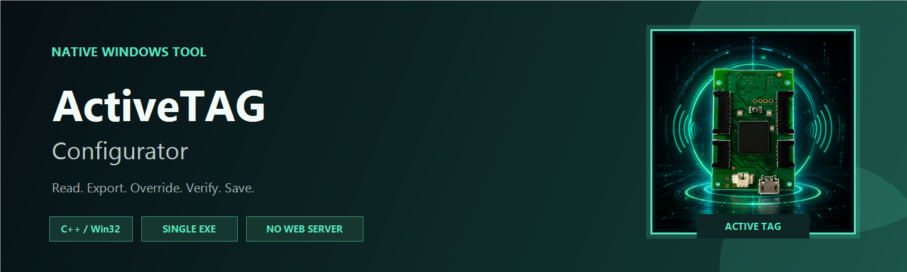
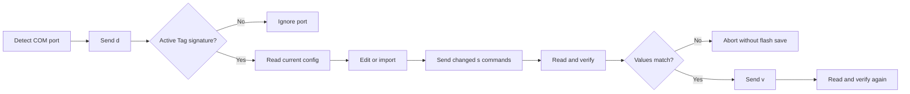

<p align="center">
  
</p>

<p align="center">
  Native Windows configuration utility for OptiTrack Active Tag hardware.
</p>

<p align="center">
  
  
  
  
</p>

## Overview

ActiveTAG Configurator connects directly to the virtual serial port exposed by
OptiTrack Active Tags. It reads the current device configuration, recognizes
known Label Group profiles, and safely writes selected settings back to flash.

The application is a native C++ desktop executable with a Dear ImGui and
DirectX 11 interface. It does not run a web server, embed a browser engine, or
require Node.js, .NET, Java, or a separate Visual C++ runtime on the target
computer.

## Features

| Capability | Behavior |
|---|---|
| Automatic detection | Scans available COM ports and validates the device from its `d` response |
| Device inspection | Reads serial number, firmware, hardware revision, RF settings and LED IDs |
| Config export | Saves a versioned `activetag-config/v1` JSON file |
| Config import | Loads supported values into the editor before writing |
| Manual override | Edits Uplink ID, RF Channel, LED Brightness, charging behavior and Custom LED IDs |
| Camera profiles | CAM1-CAM6 apply and lock the verified Label Group 0-5 LED patterns |
| Product selector | Separates Camera Tracker, Talent Tracker, and Lens Profiling profile families |
| Talent Tracker | Applies Label Group 6-20 profiles with only LED 4 active |
| Automatic profile selection | Opens the Camera Tracker or Talent Tracker product after matching the connected device |
| LED ID display | Shows hexadecimal IDs in the editor and decimal values underneath |
| Modern UI | Uses Dear ImGui and DirectX 11 for a tool-style desktop interface |
| Native modal flow | Confirmation, success, and runtime error dialogs use the same ImGui interface |
| Safe write | Stages values with `s`, verifies with `d`, saves with `v`, then verifies again |
| Portable delivery | Produces a statically linked single EXE and a portable ZIP |
| Persistent diagnostics | Appends timestamped serial communication logs next to the EXE |
| Native identity | Embeds a multi-resolution Windows icon and version metadata |

## Supported Fields

The firmware 2.x configuration surface currently exposed by the application:

| ID | Setting |
|---|---|
| `[2]` | Uplink ID |
| `[3]` | RF Channel |
| `[4]` | LED Brightness |
| `[5]` | On While Charging |
| `[D0]` - `[D7]` | Active marker LED IDs |

Fields reported as `[-]` are read-only. `[1] (unsupported)` is never written.
Signal Intensity is intentionally excluded from the editor and config files.
Disabled LED IDs are written as `0xFFFFFFFF` (`4294967295`). The parser still
recognizes older `0x7FFFFFFF` (`2147483647`) dumps as disabled so previously
written tags can be detected safely.

## Log File

While the application is running, it keeps the following file open next to the
executable:

```text
ActiveTAG-Configurator.log
```

The file is opened in append mode and is never overwritten. Every physical log
line, including serial device responses, receives a local timestamp with
millisecond precision. The file is flushed as events are written and closed
when the application exits.

The in-app `Clear Log` button clears only the visible log panel. The physical
log file remains append-only for diagnostics history.

Run the portable EXE from a folder where the current Windows user has write
permission.

## Safety Flow



## Build

Requirements:

- Windows x64
- Free Microsoft Visual Studio Build Tools with C++ Desktop tools
- Git for Windows

Build the native executable:

```bat
build.cmd
```

Output:

```text
build\ActiveTAG-Configurator-vX.Y.Z.exe
```

The build uses the static MSVC runtime (`/MT`), so the target machine does not
need the Visual C++ Redistributable.

Dear ImGui `v1.92.8` is vendored in `third_party/imgui` and compiled into the
EXE. The application icon and Windows version metadata are embedded directly
into the EXE. `version.json` controls the window title, file metadata, EXE
name, and portable ZIP naming.

## Test

```bat
test.cmd
```

The native parser tests validate all six captured Label Group configurations
against the real firmware `2.3.4` serial output used during development.

## Portable Package

```powershell
.\package-portable.ps1
```

Output:

```text
dist\ActiveTAG-Configurator-vX.Y.Z-Portable-x64.zip
```

The ZIP contains:

- Versioned `ActiveTAG-Configurator-vX.Y.Z.exe`
- Windows dependency check
- Official DISM/SFC repair helper
- Portable usage instructions

The executable depends only on protected Windows system components:
`KERNEL32`, `USER32`, `COMDLG32`, `ADVAPI32`, `D3D11`,
`D3DCOMPILER_47`, `IMM32`, and `SHELL32`.
These DLLs must not be copied between computers or registered with `regsvr32`.

## Project Layout

```text
src/                 Native UI, serial transport and Active Tag protocol
test/                Native parser tests
deploy/              Portable dependency and Windows repair scripts
docs/                Repository artwork
tools/               Deterministic repository artwork generation
third_party/         Vendored nlohmann/json and Dear ImGui source
build.cmd            Release EXE build
test.cmd             Native test build and execution
package-portable.ps1 Portable ZIP generation
version.json          Single source for window, EXE and release version
```

## Disclaimer

OptiTrack recommends using Active Batch Programmer for normal configuration.
Incorrect Active IDs or RF settings can prevent tracking from working properly.
Use this utility only when you understand the target system's ID allocation and
BaseStation configuration.

OptiTrack is a trademark of NaturalPoint, Inc. This project is an independent
configuration utility and is not affiliated with or endorsed by NaturalPoint.

## Third-Party Software

JSON support uses the MIT-licensed
[nlohmann/json](https://github.com/nlohmann/json) single-header library.
